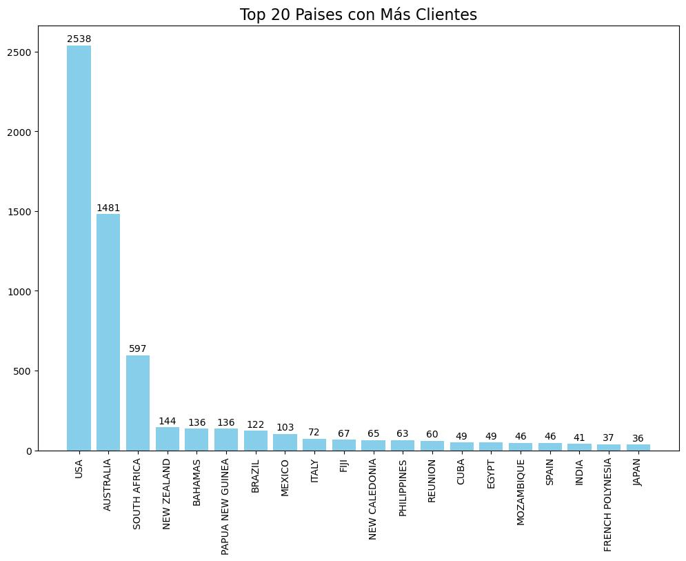
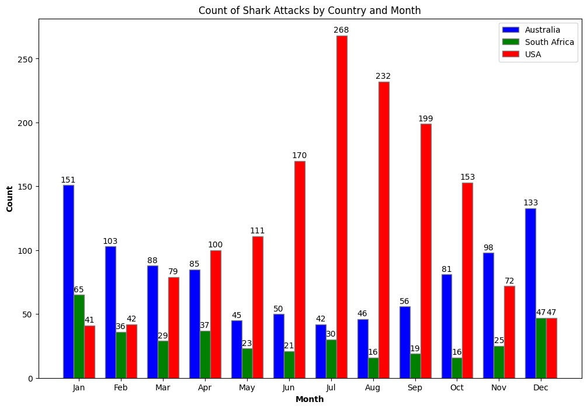
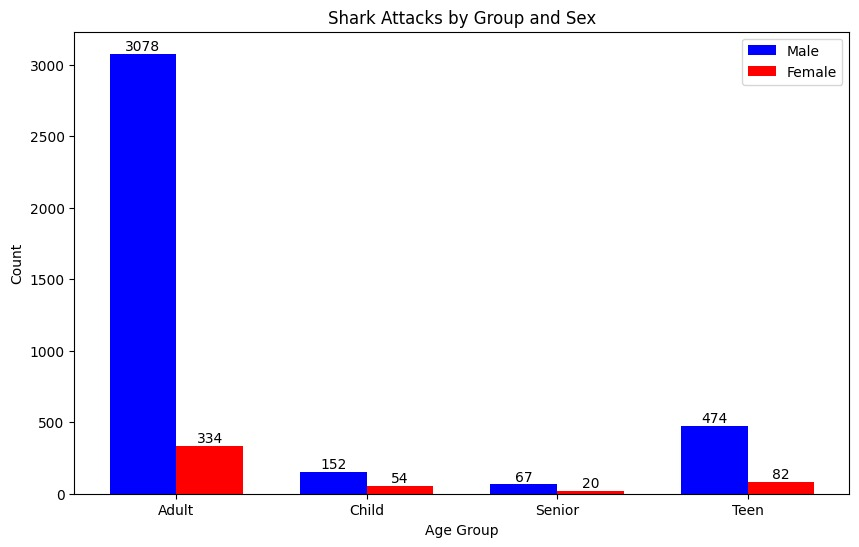
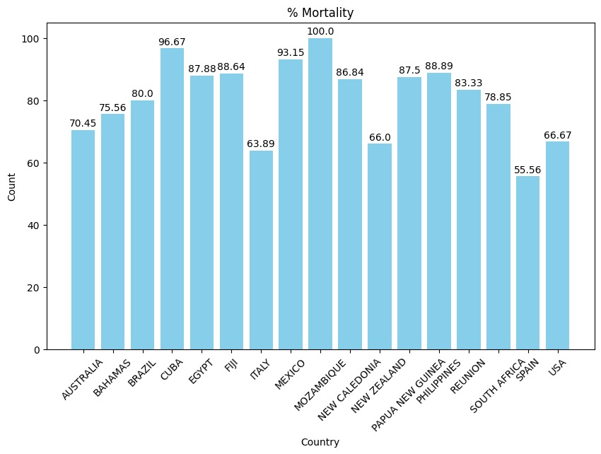

# El Mordiscos Insurance

Para hacer nuestro proyecto nos hemos basado en una empresa de seguros de viaje que necesita hacer un análisis para comprobar cuantos ataques de tiburones hay en cada país, si tiene correlacción el sexo, el mes del año y la localidad.

El programa utiliza el dataset [ataques de tiburores](./GSAF.csv) que está sin limpiar.

En [main.py](./main.py) está centrado en la limpieza de datos, para las Fechas utiliza patrones de [regex](https://docs.python.org/3/library/re.html), en este proceso hay algunas filas que no cuadran con estos patrones y el valor será cambiado a Nan, para así tener toda la columna con dos formatos, el formato datetime y el formato Nan.
En [main.py](./main.py) también se utiliza una tecnología nueva como es ollama, en este caso el modelo 'mistral', ollama es una herramienta de NLP('Natural Language Processing) de Meta, que nos permite interpretar variables categóricas y clasificarlas a nuestra conveniencia, en este caso todos los valores de la columna 'Injury', las clasifica en 'Mortal', 'No Mortal' y Nan.
Con la columna 'Age' transforma todos los valores numéricos en rangos de edad, como son 'Child','Teen', 'Adult', 'Senior'

[final.ypynb](./final.ipynb) es una libreta de jupyter notebook que con ella es mucho más sencillo de trabajar para hacer gráficos.

# Conclusiones:

Estas gráficas están hechas gracias a la librería matplotlib

Esta gráfica muestralos paises con más ataques de tiburón, que son USA, Australia y Sudáfrica. 

hipótesis: ¿Los ataques varian depende de los meses?

Esta gráfica muestra la diferencia entre los ataques de tiburon en los USA, Australia y Sudáfrica, Estados Unidos al estar en el hemisfério norte la gráfica muestra una campana de Gauss, indicando que los meses con más temperatura son los que tienen más ataques, mientras que Sudáfrica y Australia al estár en el hemisferio Sur, la gráfica es una campana de Gauss invertida, ya que los meses de más calor son el invierno del hemisferio Norte.

hipotesis: ¿Tiene algo que ver el género y la edad?

La gráfica muestra como hay un gran pico en los Adultos masculinos, esto puede ser debido a que hay más hombres que hacen deportes de riesgo como el surf, el submarinismo, etc.. estos deportes también son los Adultos los que lo practican.

hipotesis: ¿Qué país es el que tiene más porcentaje de mortalidad?

Esta gráfica está hecha con los paises que tienen más de 25 casos, ya que en el dataset hay muchos paises con 1 caso de ataque y no tiene sentido meterlo en la gráfica.
Para hacer más justo la comparación, el calculo de porcentáje de mortalidad, coge el total de los casos de fallecimiento, lo divide por el total y lo multiplica por 100, todo esto redondeado a dos decimales 